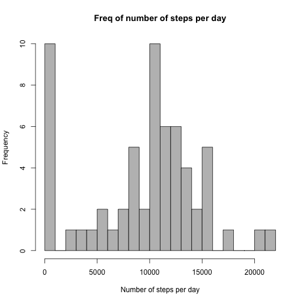
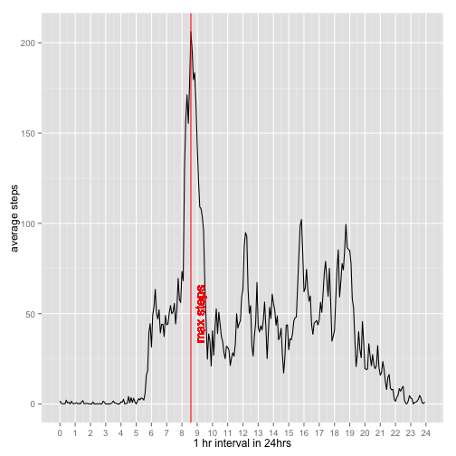
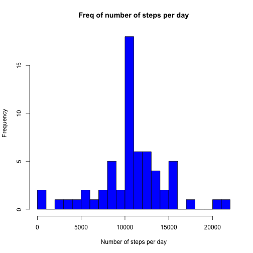
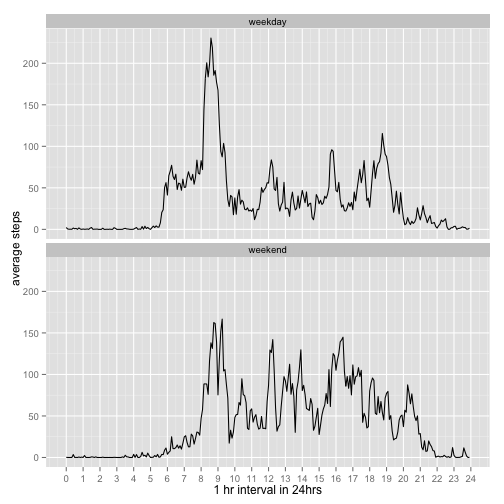

# Reproducible Research: Peer Assessment 1

## Problem Statement

This assignment makes use of data from a personal activity monitoring device. This device collects data at 5 minute intervals through out the day. The data consists of two months of data from an anonymous individual collected during the months of October and November, 2012 and include the number of steps taken in 5 minute intervals each day.

### What is mean total number of steps taken per day?

```r
# read the activity file
data <- read.csv("activity.csv")
# calculate the sum
stepsTotalPerDay <- tapply(data$steps, data$date, sum, na.rm=TRUE)

# plot the histogram  [Assignment : Make a histogram of the total number of steps taken each day]
# please note, the data used for the histogram ignores the NA values. 
# Also note, the breaks are set at 20 to get a better spread
hist(stepsTotalPerDay,  breaks =20, main = "Freq of number of steps per day", 
     xlab = "Number of steps per day", ylab = "Frequency", col='gray')
```

 

```r
# calculate the mean and median for the entire spread [Assignment: Calculate and report the mean and median of the total number of steps taken per day]
mean(stepsTotalPerDay)
```

```
## [1] 9354.23
```

```r
median(stepsTotalPerDay)
```

```
## [1] 10395
```


### What is the average daily activity pattern?

```r
library(ggplot2)
```


```r
# read in the activity data
data <- read.csv("activity.csv")

# change the intervals such that they are in seconds 
# Example, say the raw data on row 30 has interval of 225, it should be read as 2 hrs 25 mins, which is 145 mins.
data$interval <- 60*floor((data$interval)/100) + (data$interval %% 100)

# calculate the avgdata [ the interval here are in mins]
avgdata <- aggregate(steps ~ interval, data = data, mean, na.rm = TRUE)
# plot using ggplot. note that interval is further divided by 60 to get the graph based on 24 hr clock
plot <- ggplot(data = avgdata,aes(x = interval/60, y = steps)) 
plot <- plot + geom_line() + xlab("1 hr interval in 24hrs") + ylab("average steps")
plot <- plot + scale_x_continuous(breaks=0:24)

# find the max average and plot it as a red line on the time series
maxsteps <- as.numeric(avgdata[which.max(avgdata$steps), ]/60)[1]
plot <- plot + geom_vline(xintercept =maxsteps , colour = 'red')
plot <- plot +  geom_text(aes(x=maxsteps, label="\nmax steps", y=50), color="red", angle=90, text=element_text(size=2)) 
plot
```

 

Q: Which 5-minute interval, on average across all the days in the dataset, contains the maximum number of steps?

```r
maxsteps
```

```
## [1] 8.583333
```

```r
cat('As time, the 5-minute interval containing the maximum number of steps is -- ', 
    as.numeric(avgdata[which.max(avgdata$steps), ])[1] %/%60,":", 
    as.numeric(avgdata[which.max(avgdata$steps), ])[1] %%60)
```

```
## As time, the 5-minute interval containing the maximum number of steps is --  8 : 35
```
### Imputing missing values


```r
#Calculate and report the total number of missing values in the dataset
missingvalues <- is.na(data$steps)
table(missingvalues)
```

```
## missingvalues
## FALSE  TRUE 
## 15264  2304
```

Strategy for imputing missing data
Find the intervals in the data where the value of steps is NA and then replace it with the average of the steps for that interval. As per the instructions 'new dataset that is equal to the original dataset', a new dataset is created and mapply is used to replace the NA values.


```r
#Fill missing values
#function fillmissing to replace the NAs with the average calculated above where the intervals match
fillmissing <- function(ipsteps, ipinterval) {
  if (!is.na(ipsteps)) {
    retval<- ipsteps 
  }
  else {
    retval<- (avgdata[avgdata$interval == ipinterval,]$steps)
  }
  retval
}
#create a copy of the data read in and use that for plotting
newdata <- data
newdata$steps <- mapply(fillmissing, newdata$steps, newdata$interval)

#Check missing values in new dataset
newmissingvalues <- is.na(newdata$steps)
table(newmissingvalues)
```

```
## newmissingvalues
## FALSE 
## 17568
```


```r
# calculate the sum as before for the filled in dataset
stepsTotalPerDayWithoutNas <- tapply(newdata$steps, newdata$date, sum, na.rm=TRUE)

# plot the histogram as before, same intervals and same number of breaks.
hist(stepsTotalPerDayWithoutNas,  breaks =20, main = "Freq of number of steps per day", 
     xlab = "Number of steps per day", ylab = "Frequency", col='blue')
```

 

```r
# calculate the mean and median for the entire spread
mean(stepsTotalPerDayWithoutNas)
```

```
## [1] 10766.19
```

```r
median(stepsTotalPerDayWithoutNas)
```

```
## [1] 10766.19
```

Q: Do these values differ from the estimates from the first part of the assignment? What is the impact of imputing missing data on the estimates of the total daily number of steps?

The values do differ from the first part of the assignment. There were quite a few data rows with NA which now have been replaced by their interval average. Because this, the mean and the median calculated on this modified dataset are higher than the ones in first assignment.

### Are there differences in activity patterns between weekdays and weekends?


```r
# this part of the excercise assumes the above data 'stepsTotalPerDayWithoutNas' is present

# change the date string to be a Date type
newdata$date <- as.Date(newdata$date, '%Y-%m-%d')

# create a factor to indicate whether the day is weekday or weekend
daytype <- factor(weekdays(newdata$date) %in% c("Saturday","Sunday"), 
                  labels=c("weekday","weekend"), ordered=FALSE)

#calculate the new avgdata by interval and day
newavgdata <- aggregate(steps ~ interval + daytype, data = newdata, mean, na.rm = TRUE)

#plot the graph with facet_wrap for the weekday and weekend separation
plot <- ggplot(data = newavgdata,aes(x = interval/60, y = steps)) 
plot <- plot + geom_line() + xlab("1 hr interval in 24hrs") + ylab("average steps")
plot <- plot + scale_x_continuous(breaks=0:24)
plot <- plot + facet_wrap( ~daytype, ncol=1)
plot
```

 


Few Observations

- The highest number of steps are on weekday
- Overall higher activity wrt steps on weekend compared to weekdays. Also its more or less higher compared to the weekeday where the activity is more varied.
- Weekday the number of steps step up from zero to a valid number earlier, around 6am, compared to weekend when it starts more around 8am. Also, on weekdays, highest number of steps are between 8-9am(peak office hours), whereas over the weekend, it seems to be little later.
